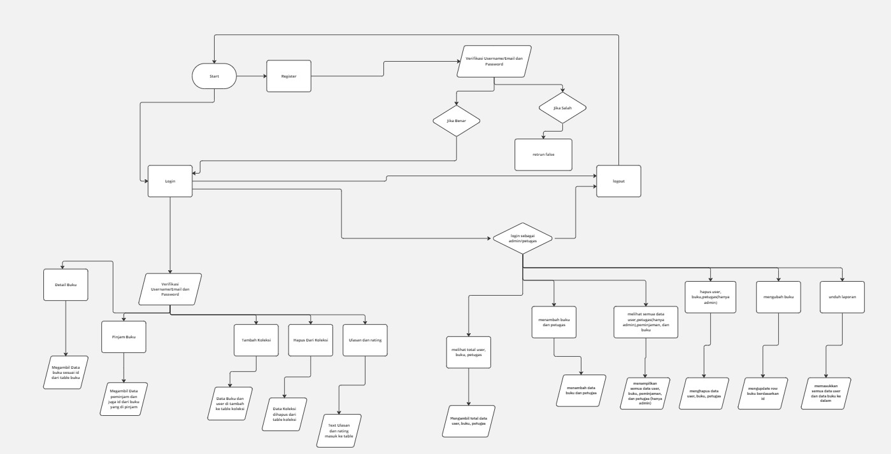

### Dokumentasi Program UKK RPL 2024 | Intelligent Library – Josua Natanael Panjaitan XII RPL 1

**Pendahuluan** 

Intelligent Library merupakan website berbasis php native yang di dalamnya ada crud yang bekerja 

**Design**

https://www.figma.com/file/bSUbfghFOWSaTBEjKSEahR/bukuaku?type=design&node-id=0%3A1&mode=design&t=1PZU2EhIlgdclwfu-1

**Teknologi yang dipakai** 

Designing UI/UX = Figma  
Front-end = html,css,  
Back-end = php  

**Diagram alur kerja sistem(flowchart)**

